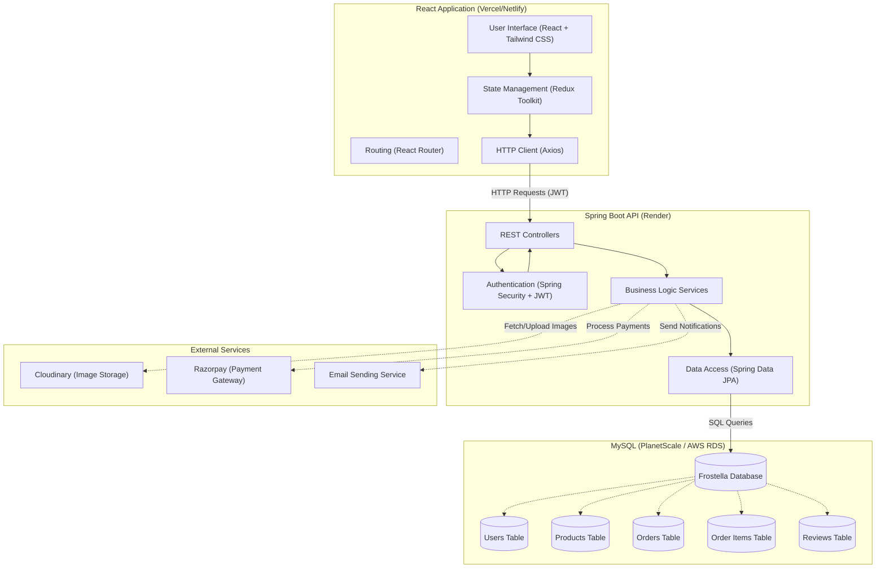

# Frostella System Architecture

This diagram illustrates the 3-tier system architecture for Frostella, a modern home-based bakery web application.

```mermaid
graph TD
    subgraph Frontend ["React Application (Vercel/Netlify)"]
        UI["User Interface (React + Tailwind CSS)"]
        State["State Management (Redux Toolkit)"]
        Router["Routing (React Router)"]
        Axios["HTTP Client (Axios)"]
    end

    subgraph Backend ["Spring Boot API (Render)"]
        Controllers["REST Controllers"]
        Security["Authentication (Spring Security + JWT)"]
        Services["Business Logic Services"]
        Repositories["Data Access (Spring Data JPA)"]
    end

    subgraph Database ["MySQL (PlanetScale / AWS RDS)"]
        DB[(Frostella Database)]
        DB -.-> Users[(Users Table)]
        DB -.-> Products[(Products Table)]
        DB -.-> Orders[(Orders Table)]
        DB -.-> OrderItems[(Order Items Table)]
        DB -.-> Reviews[(Reviews Table)]
    end

    subgraph External ["External Services"]
        Cloudinary["Cloudinary (Image Storage)"]
        Razorpay["Razorpay (Payment Gateway)"]
        EmailService["Email Sending Service"]
    end

    %% Flow of data
    UI --> State
    State --> Axios
    Axios -- "HTTP Requests (JWT)" --> Controllers
    Controllers --> Security
    Security --> Controllers
    Controllers --> Services
    Services --> Repositories
    Repositories -- "SQL Queries" --> DB

    %% External Connections
    Services -. "Fetch/Upload Images" .-> Cloudinary
    Services -. "Process Payments" .-> Razorpay
    Services -. "Send Notifications" .-> EmailService
```
